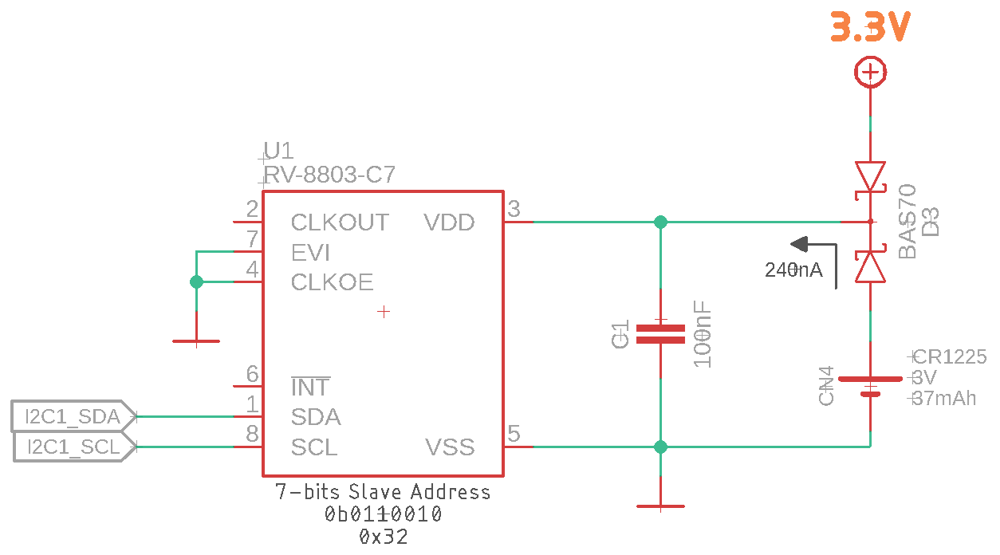

# RV-8803-C7 Real-Time Clock Library (ESP32 + Arduino)

An Arduino-compatible library for interfacing with the **Micro Crystal RV-8803-C7** I²C real-time clock (RTC), supporting easy **epoch-based time read/write**.

## 🚀 Key Features

- Simple read/write using [Unix Epoch](https://www.epochconverter.com/) (`time_t`)
- Compatible with ESP32 and other Arduino-compatible boards
- Uses standard I²C communication via `Wire` or `Wire1`
- No internal `Wire.begin()` — user initializes I²C externally
- Human-readable and epoch-friendly interface

---

## 🧰 Basic Usage

```cpp
RV8803 rtc;

void setup() {

    Serial.begin(19200);

    Wire.begin(48, 47); // SDA, SCL (or use Wire.begin() for default pins)

    time_t now = 1704067200; // Example: Jan 1, 2024
    if (rtc.set_epoch(now))
        Serial.println("RTC time written successfully.");
    else 
        Serial.println("Failed to write time to RTC.");    
}

void loop() {

    time_t now = rtc.get_epoch();
    struct tm *tm = gmtime(&now);

    Serial.printf(
        "%04d-%02d-%02d %02d:%02d:%02d UTC (%ld)\n",
        tm->tm_year + 1900,
        tm->tm_mon + 1,
        tm->tm_mday,
        tm->tm_hour,
        tm->tm_min,
        tm->tm_sec,
        now
    );

    delay(1000);
}
```


> 🧠 This library simplifies working with the RV-8803 by abstracting I²C register handling into clean epoch-based functions.

---

## 🔌 Basic Circuit



---

## 🖥️ Serial Terminal Output


---

## 📎 Documentation & Reference

- 📄 [RV-8803-C7 Datasheet (PDF)](assets/RV-8803-C7.pdf)
- 🔋 [CR1225 Coin Cell Specs (PDF)](assets/CR1225.pdf)

---
### 📍 I²C Slave Address 


> The I²C address of the RV-8803 is **fixed at `0x32`** and cannot be changed.

---

## ✅ Compatibility

This library was tested with:

- **ESP32 Arduino Core v3.2.0**  
  Based on **ESP-IDF v5.4.1**  
  🔗 [GitHub Release: espressif/arduino-esp32 v3.2.0](https://github.com/espressif/arduino-esp32/releases/tag/3.2.0)

> For best results, use this or a later version of the Arduino-ESP32 core.
